# Jahresplanung — Einführung für Lehrpersonen

Diese Kurzanleitung führt dich durch alle Funktionen der interaktiven Jahresplanung für das 1. Lehrjahr ABU (EFZ 3-Jährige, Schuljahr 2025/26).

## Überblick

### 1. Öffne die **Jahresplanung** über die Navigation der Hauptplattform. Die Seite zeigt dir auf einen Blick das gesamte Schuljahr 2025/26 für das 1. Lehrjahr EFZ 3-Jährige.

http://localhost:4321/jahresplanung

### 2. **Kennzahlen auf einen Blick** — Die fünf Statistik-Kacheln zeigen die wichtigsten Planungsgrössen: 39 Schulwochen, 117 verfügbare Lektionen, aufgeteilt in 90 L. Unterricht und 27 L. Puffer (+ 8 Ferienwochen).

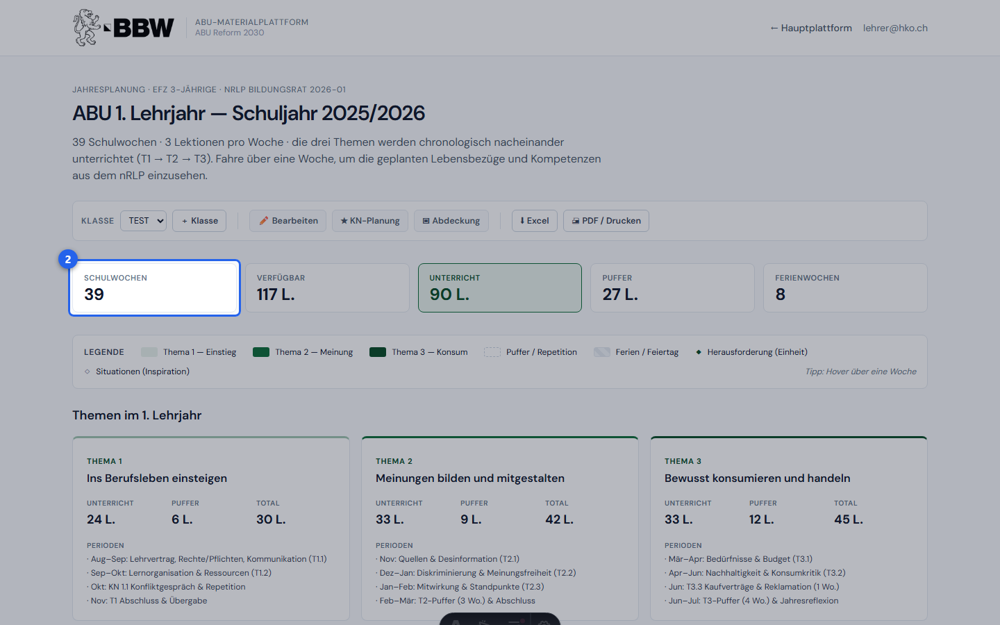

http://localhost:4321/jahresplanung

### 3. **Legende** — Die Legende erklärt die Farben im Kalender: Thema 1 (hellgrün), Thema 2 (mittelgrün), Thema 3 (dunkelgrün), Puffer/Repetition (grau) und Ferien/Feiertage (gestrichelt). Das ◆-Symbol markiert eine Herausforderung (fertige Einheit), ◇ steht für Situationen zur Inspiration.

http://localhost:4321/jahresplanung

## Themen & SK

### 4. **Themen-Übersicht** — Die drei Themenkarten zeigen Titel, Lektionenverteilung (Unterricht / Puffer / Total) und die Unterrichtsperioden auf einen Blick. Thema 1 «Ins Berufsleben einsteigen» (30 L.), T2 «Meinungen bilden» (42 L.) und T3 «Bewusst konsumieren» (45 L.).

http://localhost:4321/jahresplanung

### 5. **SK-Abdeckungsmatrix** — Diese Tabelle zeigt, welche der 12 Schlüsselkompetenzen (SK) in welchem Thema eingeplant sind und in welcher Iterationstiefe: R1 = erste Begegnung (hellgrün), R2 = Wiederaufnahme (mittelgrün), R3 = Vertiefung (dunkelgrün). Graue Zeilen sind im 1. Lehrjahr nicht vorgesehen.

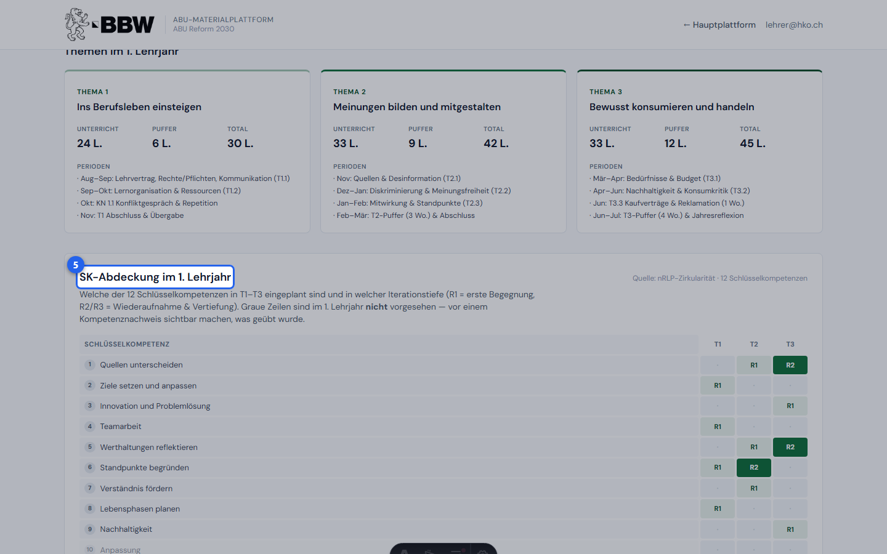

http://localhost:4321/jahresplanung

## Feiertage & Kalender

### 6. **Feiertage & didaktische Hinweise** — Dieses ausklappbare Panel listet alle Wochen mit besonderem Vermerk: links Feiertage und Brückentage (z.B. Karfreitag, Auffahrt), rechts didaktische Hinweise wie geplante Kompetenznachweise oder Prüfungswochen.

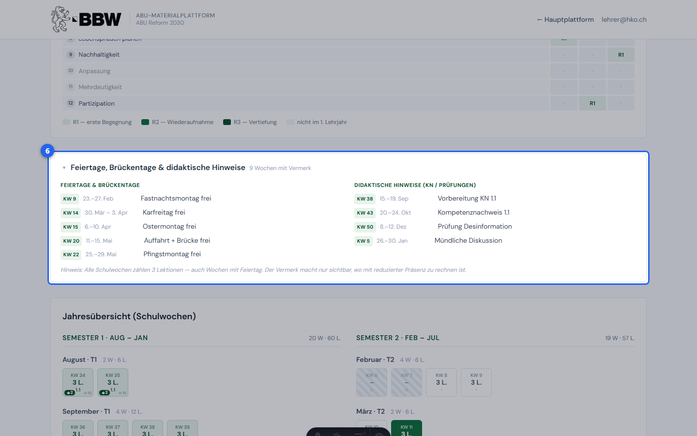

http://localhost:4321/jahresplanung

### 7. **Kalender-Grid** — Das Herzstück der Seite: alle 47 Schulwochen des Jahres, aufgeteilt in zwei Semester (Aug–Jan und Feb–Jul). Jede Kachel zeigt KW-Nummer, Lektionen und Lebensbezug-Code. Farbige Kacheln = Unterricht, graue = Puffer, gestrichelte = Ferien.

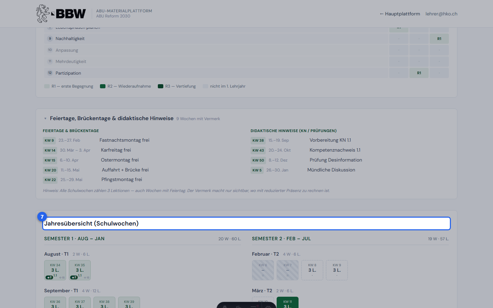

http://localhost:4321/jahresplanung

### 8. **Hover-Tooltip** — Fahre mit der Maus über eine beliebige Unterrichtswoche. Der Tooltip zeigt den genauen Lebensbezug, nRLP-Kompetenzen, empfohlene SKs und Sprachmodi sowie verknüpfte Herausforderungen (◆) und Situationen (◇) als direkte Links.

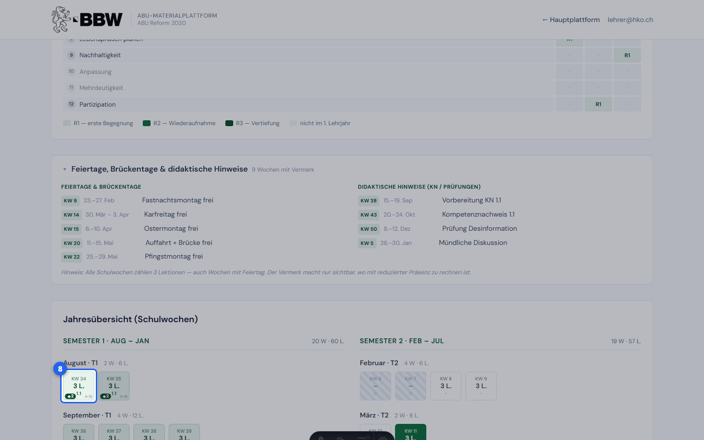

http://localhost:4321/jahresplanung

## Planung

### 9. **Planungs-Toolbar** — Die Werkzeugleiste oben enthält alle interaktiven Funktionen: Klassen-Instanzen verwalten, Bearbeitungsmodus, KN-Planung, Abdeckungscheck sowie Export-Buttons für Excel und PDF.

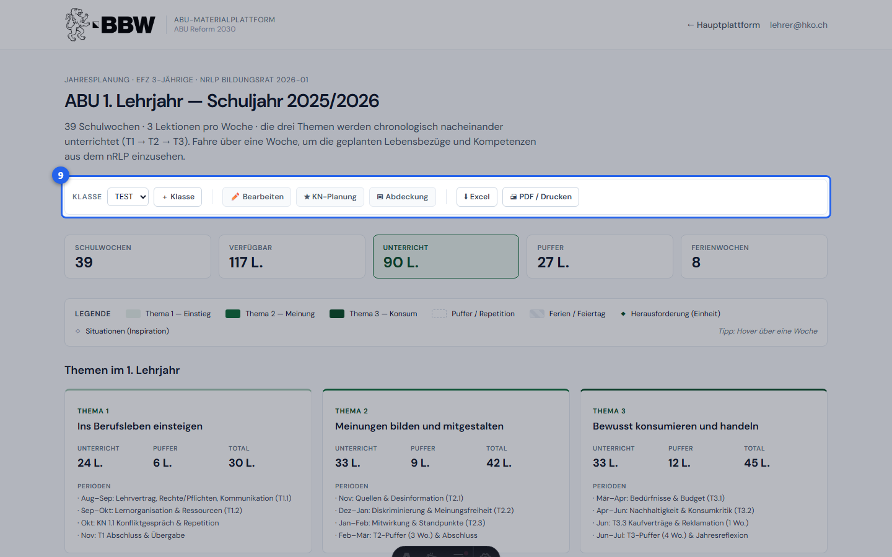

http://localhost:4321/jahresplanung

### 10. **Neue Klasse anlegen** — Klicke auf **＋ Klasse**, um eine benannte Plan-Instanz für deine Klasse zu erstellen (z.B. «EFZ-3J 2025 KL-A»). Jede Instanz speichert Anpassungen, KN-Termine und Abdeckungscheck separat — ideal für mehrere Klassen.

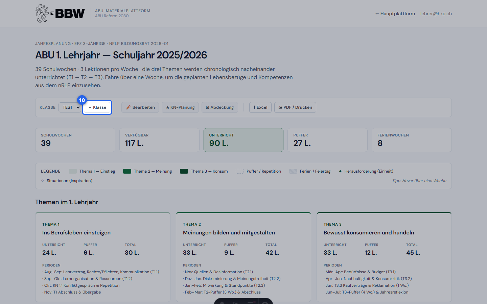

http://localhost:4321/jahresplanung

### 11. **KN-Planung aktivieren** — Klicke auf **★ KN-Planung**, um den Kompetenznachweisplaner einzublenden. Woche, Format (Fachgespräch / Mini-Case / Werkschau / Andere) und Notizen pro KN — alles gespeichert pro Klasse.

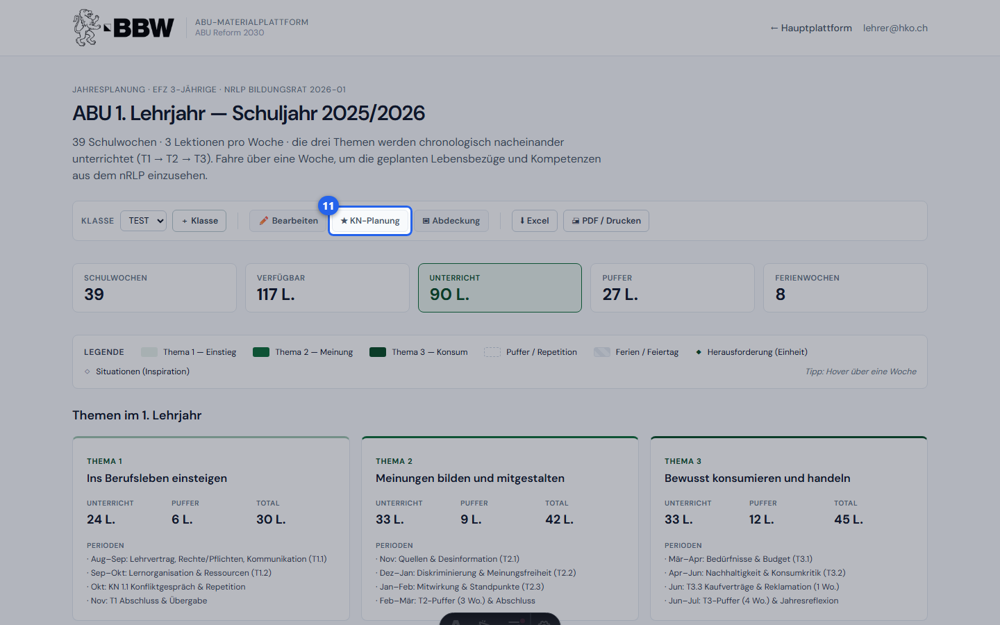

http://localhost:4321/jahresplanung

### 12. **KN-Planer** — Der Planer listet automatisch drei Kompetenznachweise auf (einen pro Thema). Wähle Unterrichtswoche und Format aus dem Dropdown und notiere vorbereitende Situationen.

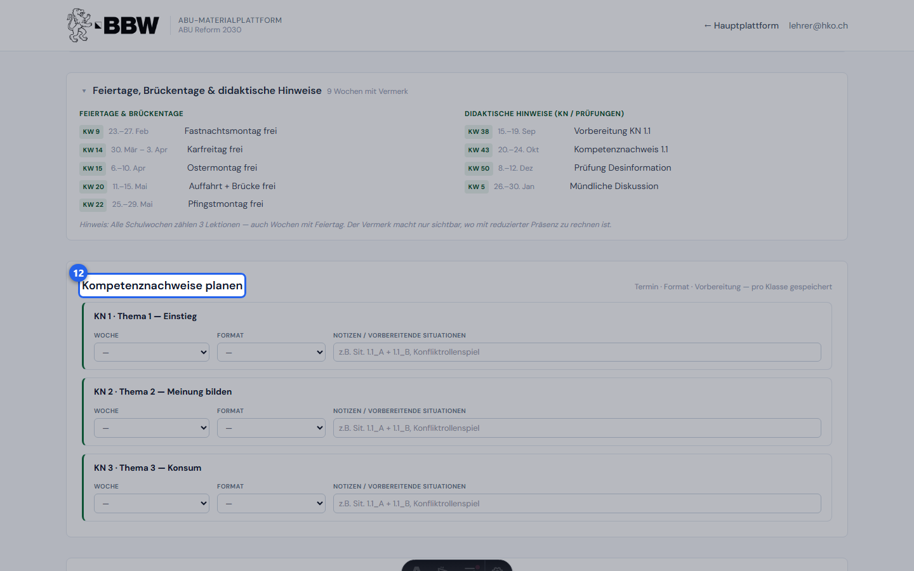

http://localhost:4321/jahresplanung

## Abdeckung

### 13. **Abdeckungscheck aktivieren** — Klicke auf **▣ Abdeckung**, um den Live-Abdeckungscheck zu öffnen. Hier hakst du nach dem Unterricht ab, welche Schlüsselkompetenzen und Sprachmodi du pro Lebensbezug tatsächlich geübt hast.

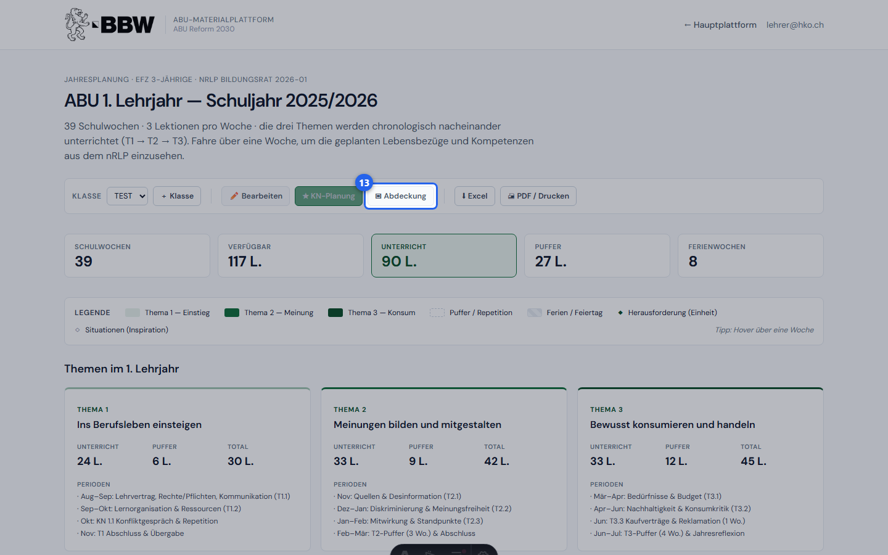

http://localhost:4321/jahresplanung

### 14. **Abdeckung pro Lebensbezug** — Für jeden unterrichteten Lebensbezug erscheinen die nRLP-empfohlenen SK und Sprachmodi als Checkboxen. Die SK-Chips oben zeigen sofort, wie oft du jede Kompetenz eingesetzt hast — Lücken sind auf einen Blick erkennbar.

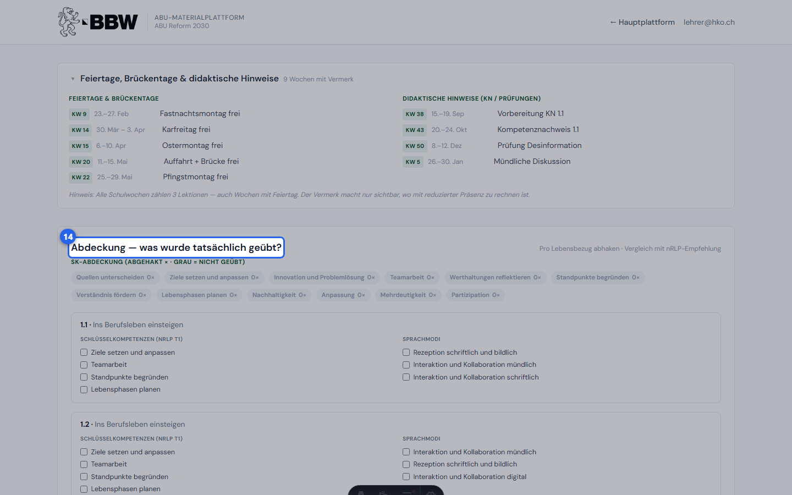

http://localhost:4321/jahresplanung

## Export

### 15. **Export** — Mit **⬇ Excel** exportierst du den Jahresplan als `.xlsx`-Datei (mit Lebensbezügen, SKs, Sprachmodi und Herausforderungen pro Woche). Mit **🖨 PDF / Drucken** öffnet sich der Browser-Druckdialog — optimiert für A4 Querformat.

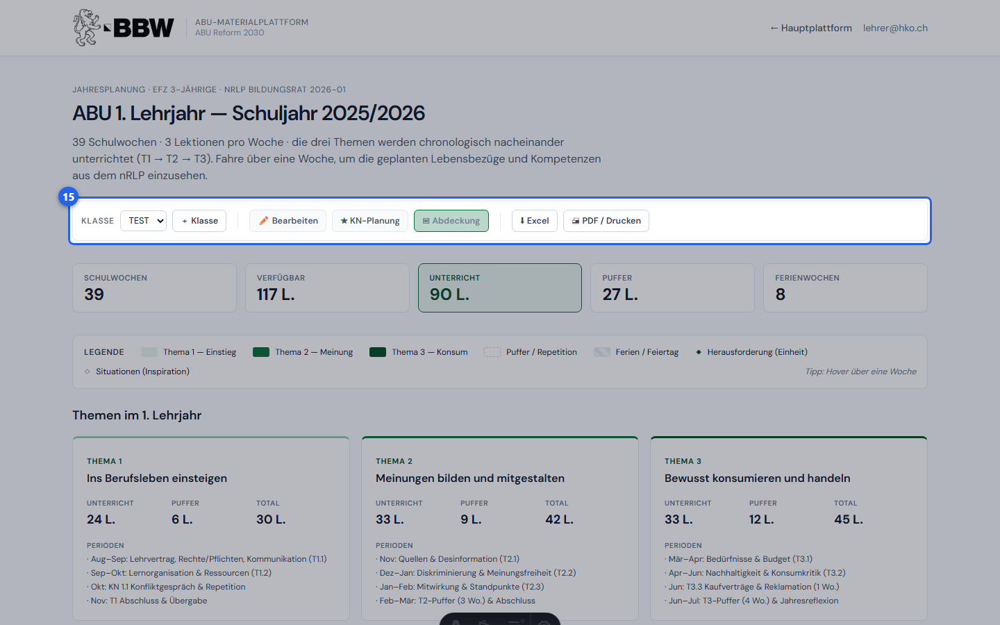

http://localhost:4321/jahresplanung
