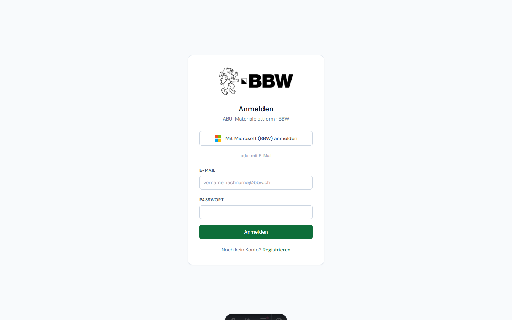
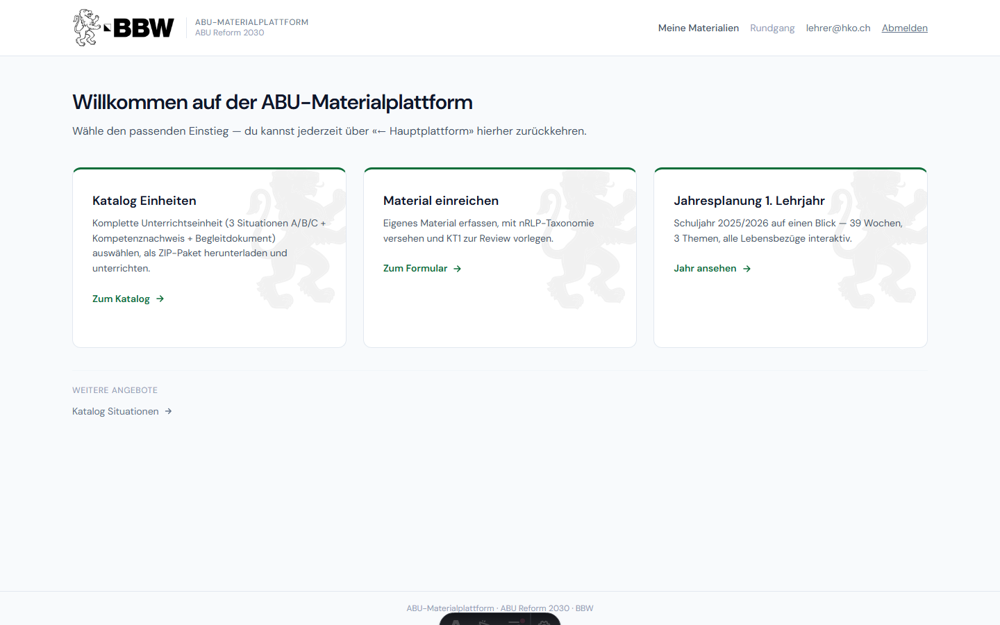
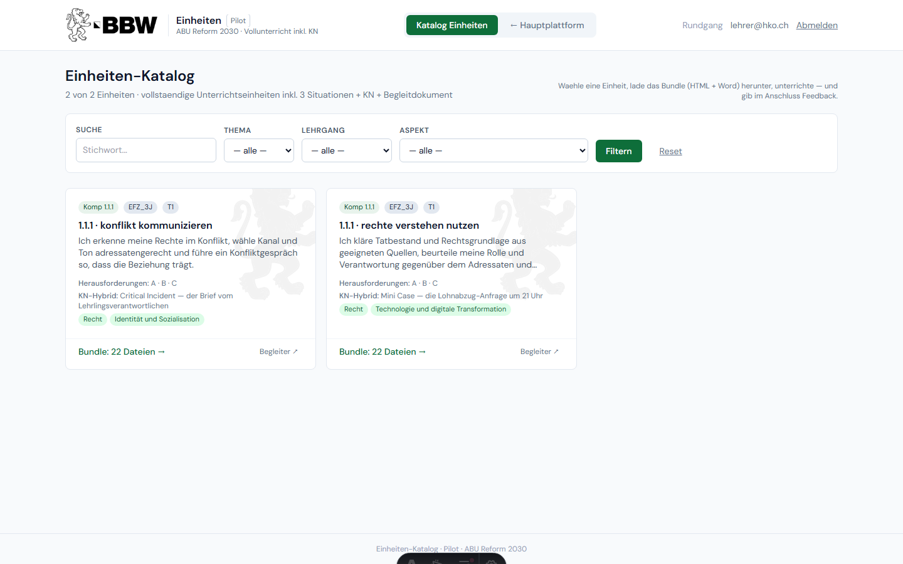
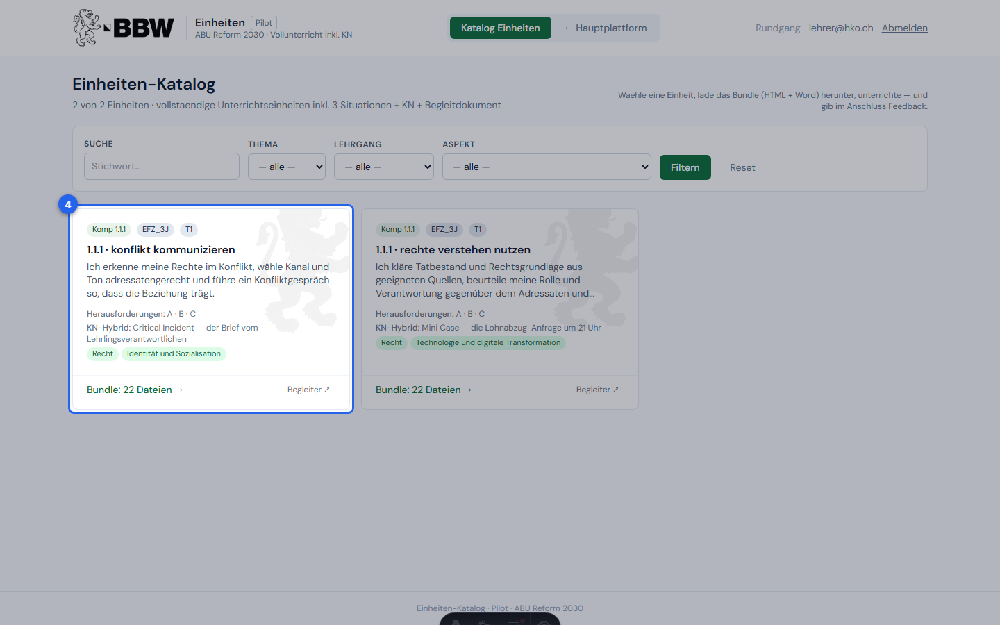
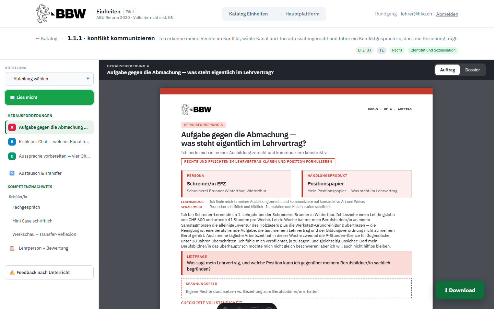
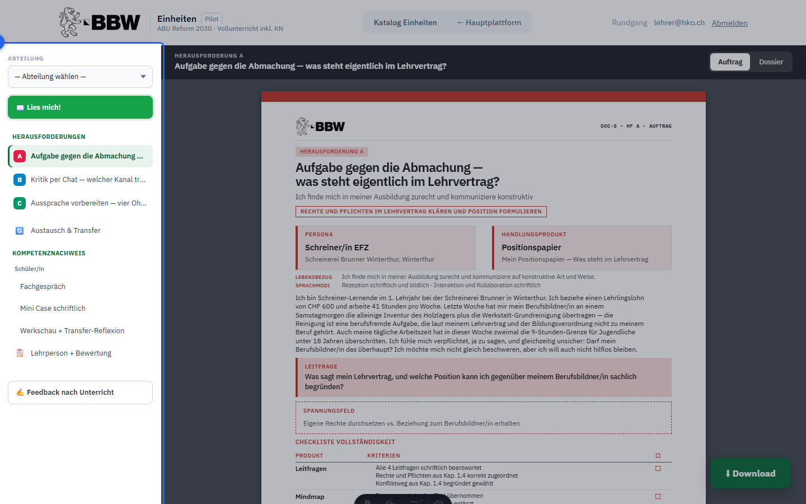
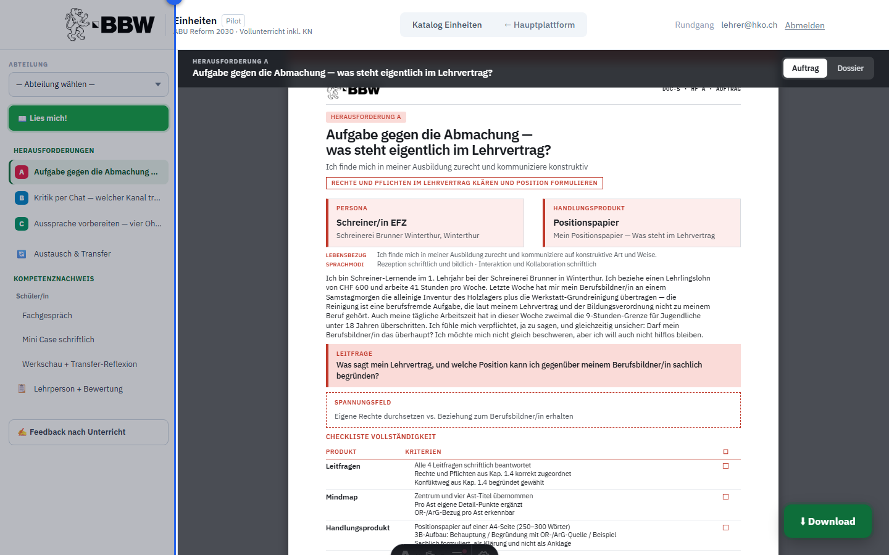
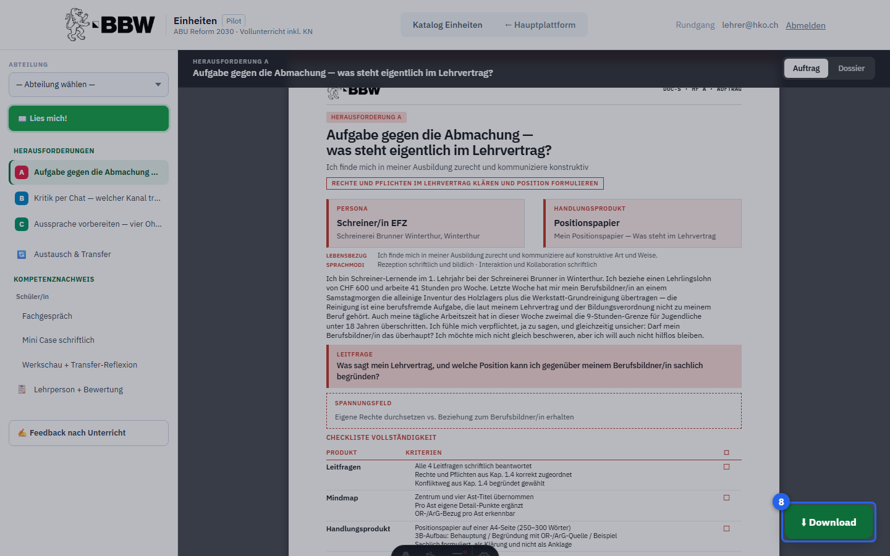
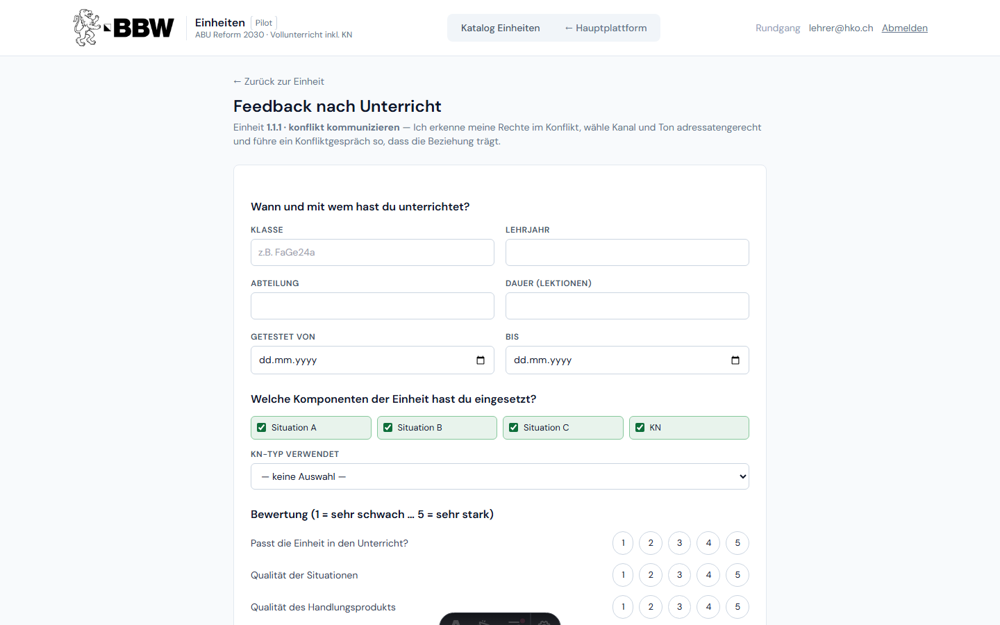

# ABU-Materialplattform — Einführung & Rundgang

Ein geführter Rundgang durch die Plattform — vom Login über den Hub bis zur kompletten Unterrichtseinheit. Schritt für Schritt: wo ist was.

## Anmelden

### 1. Öffne die Plattform unter **bbw-hko.vercel.app**. BBW-Lehrpersonen klicken auf **«Mit Microsoft (BBW) anmelden»** — kein zusätzliches Passwort nötig. Alternativ: Login mit E-Mail und Passwort.

http://localhost:4321/login

## Hauptplattform

### 2. Nach dem Login erscheint die **Hauptplattform** mit drei Einstiegs-Kacheln. Von hier führen alle Wege weiter — und über **«← Hauptplattform»** in der Navigationsleiste kommst du jederzeit wieder hierher zurück.

http://localhost:4321/

## Einheiten-Katalog

### 3. Klicke auf **«Katalog Einheiten»** (oder navigiere direkt über die Leiste). Der Katalog zeigt alle fertigen Unterrichtseinheiten — jede enthält 3 Situationen A/B/C, einen Kompetenznachweis und ein Begleitdokument.

http://localhost:4321/einheiten

### 4. Jede **Einheiten-Karte** zeigt auf einen Blick: Kompetenz-Nr., Lehrgang, Thema, das Kompetenzversprechen, die drei Situationen A · B · C sowie die Aspekte. **«Bundle: N Dateien →»** öffnet die Werkbank; **«Begleiter ↗»** öffnet direkt das Lehrpersonen-Begleitdokument.

http://localhost:4321/einheiten

## Werkbank

### 5. Klicke auf **«Bundle: N Dateien →»**, um die **Werkbank** zu öffnen. Links die Navigationsleiste (Sidebar), rechts die grosse Dokumentvorschau.

http://localhost:4321/einheiten/1.1.1_konflikt_kommunizieren

### 6. Die **Sidebar** listet alle Dokumente der Einheit als Baum: Herausforderungen A · B · C, Austausch & Transfer, Kompetenznachweis (Schüler/in + Lehrperson) und den Feedback-Button. Ein Klick auf einen Eintrag zeigt das Dokument sofort rechts an.

http://localhost:4321/einheiten/1.1.1_konflikt_kommunizieren

### 7. Im **Vorschau-Bereich** siehst du live, wie das Dokument aussieht — druckfertig als A4-Seite. Oben im dunklen Dokumentkopf schaltest du beim Situationsheft zwischen **Auftrag** (leere Vorlage für Lernende) und **Dossier** (mit ausgearbeiteter Lösung) um.

http://localhost:4321/einheiten/1.1.1_konflikt_kommunizieren

### 8. Der grüne **Download-Button** unten rechts lädt die gesamte Einheit als ZIP-Paket herunter — alle Dokumente als HTML und Word, plus Begleiter und README. Eine Einheit umfasst typischerweise 22–33 Dateien.

http://localhost:4321/einheiten/1.1.1_konflikt_kommunizieren

## Nach dem Unterricht

### 9. Nach dem Unterricht: Klicke in der Werkbank auf **«Feedback nach Unterricht»**. Das Formular erfasst, wie die Einheit lief — welche Situationen und KN-Typen eingesetzt wurden, was gut klappte und was verbessert werden sollte. Jedes Feedback fliesst direkt ins Review des Kernteams 1.

http://localhost:4321/einheiten/1.1.1_konflikt_kommunizieren/feedback
