# Prompt-Builder — vom Lehrplan zum fertigen LLM-Prompt

Schritt für Schritt: aus Thema, Lebensbezug und Kompetenz der nRLP einen ausgefeilten Prompt für Lernsituationen, Aufgaben, Beurteilungsraster, Prüfungen, Arbeitsblätter und Reflexionen erzeugen — und kopieren.

## Werkzeug öffnen

### 1. Der **Prompt-Builder**. Über **«← NRLP»** gelangst du zurück zum Lehrplan-Graphen. Ganz oben wählst du den **Lehrgang** (EFZ 3-jährig / 4-jährig / EBA), darunter den **Modus** A / B / C. Links triffst du deine Auswahl, rechts entsteht laufend der fertige Prompt.

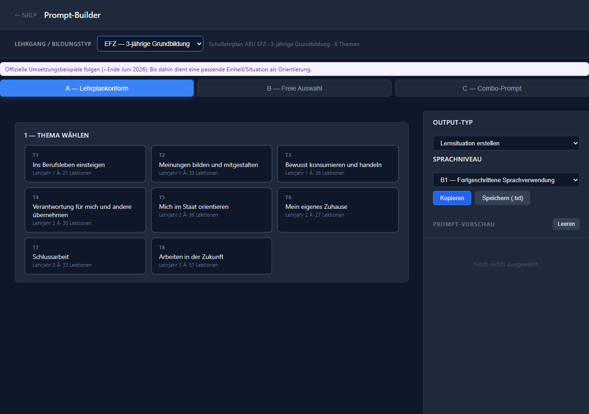

http://localhost:4321/nrlp/prompt-builder/index.html?role=lp

## Auswahl treffen (Modus A)

### 2. Bleibe im Modus **«A — Lehrplankonform»**. Er führt dich der Reihe nach durch **Thema → Lebensbezug → Kompetenz** — genau entlang des neuen Rahmenlehrplans (nRLP).

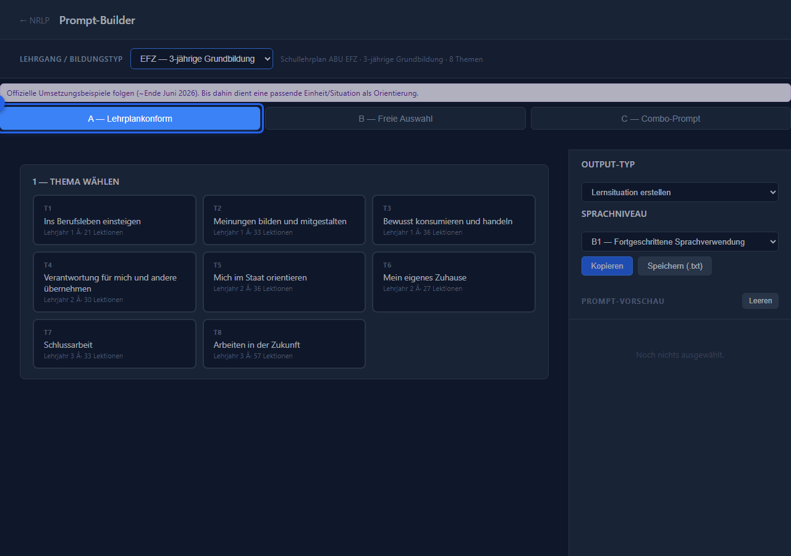

http://localhost:4321/nrlp/prompt-builder/index.html?role=lp

### 3. Wähle ein **Thema** aus dem Lehrplan (hier **Thema 1 — Ins Berufsleben einsteigen**). Jede Karte zeigt Titel, Lehrjahr und Lektionenzahl.

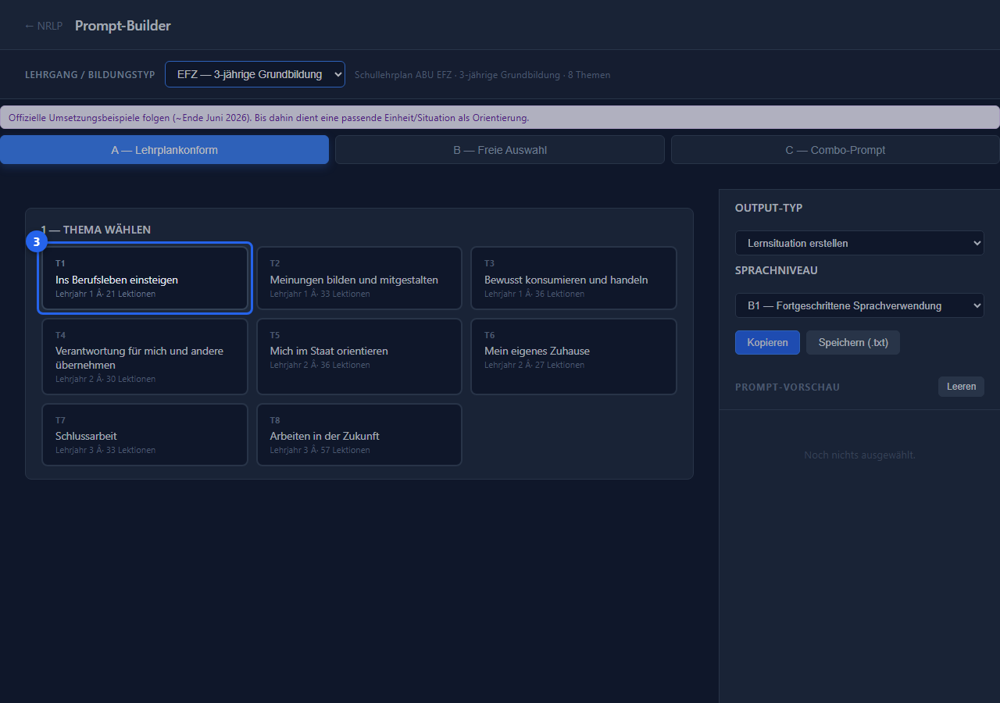

http://localhost:4321/nrlp/prompt-builder/index.html?role=lp

### 4. Klappe einen **Lebensbezug** auf und wähle ihn (z. B. **1.1**). Darunter erscheinen die zugehörigen Kompetenzen.

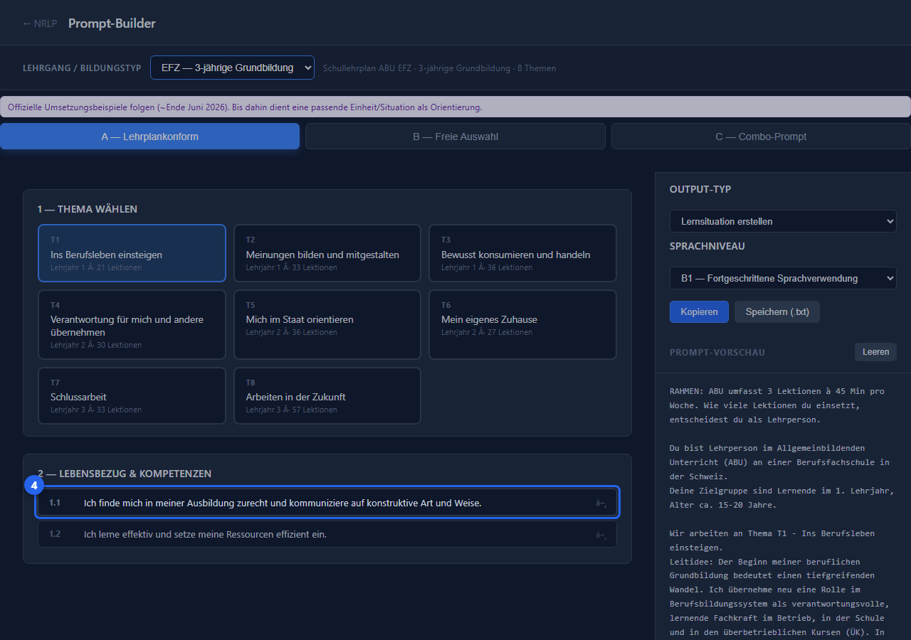

http://localhost:4321/nrlp/prompt-builder/index.html?role=lp

### 5. Wähle eine oder mehrere **Kompetenzen** (z. B. **1.1.1**). Mehrfachauswahl ist möglich — und rechts füllt sich sofort der Prompt.

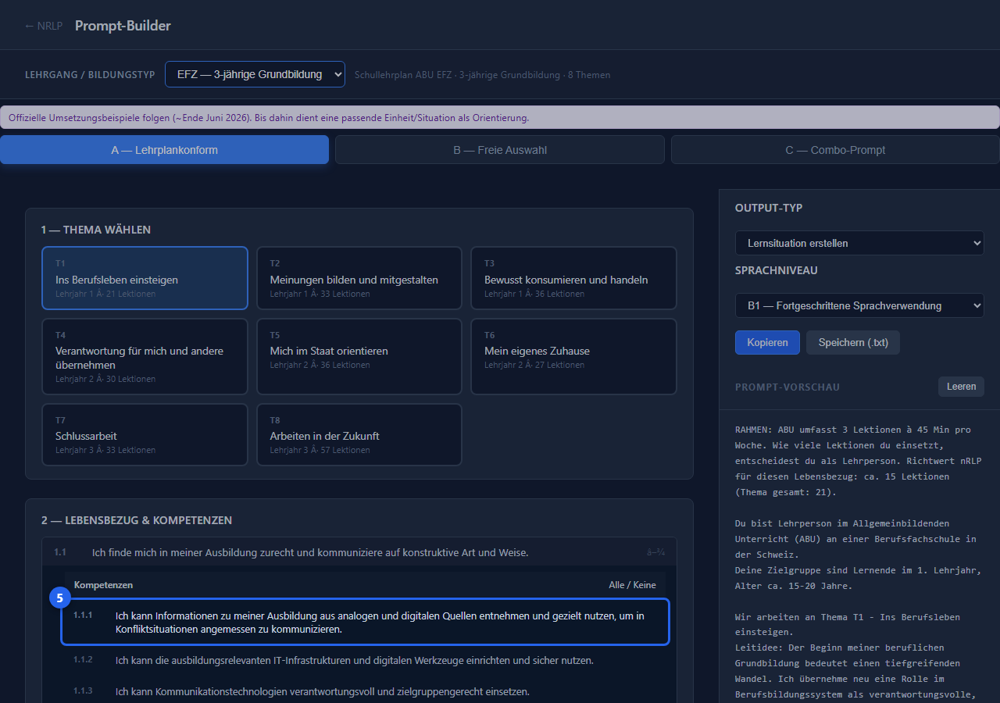

http://localhost:4321/nrlp/prompt-builder/index.html?role=lp

## Automatische Taxonomie

### 6. Der Builder zieht **automatisch** die passende Taxonomie zur gewählten Kompetenz: **Gesellschaftliche Inhalte** und **Sprachmodi** — jeweils mit Progressionsstufe (R1–R3). Wähle ab, was für deine Einheit nicht relevant ist. Rechts wächst der Prompt entsprechend mit.

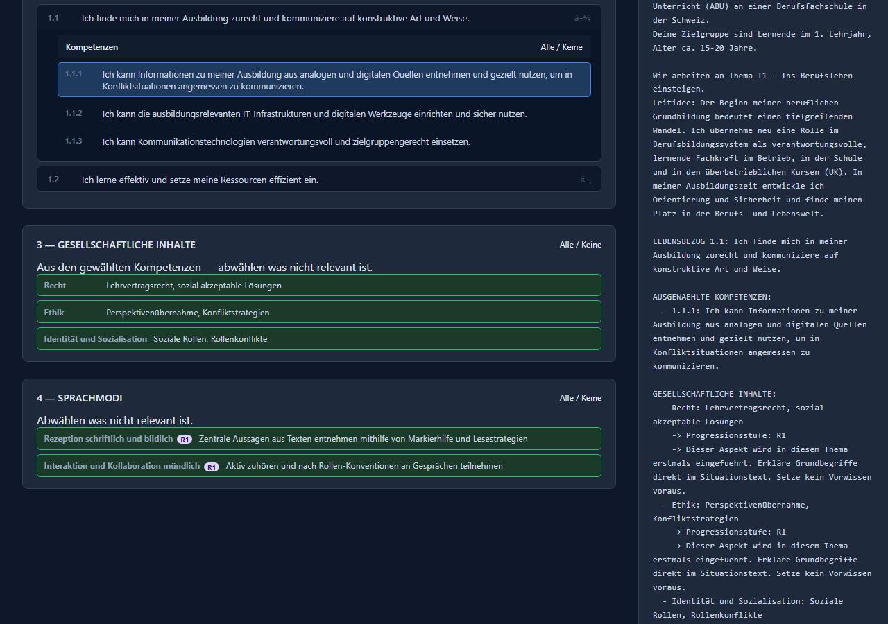

http://localhost:4321/nrlp/prompt-builder/index.html?role=lp

## Output-Typ wählen & kopieren

### 7. Wähle rechts oben den **Output-Typ**. Sechs Typen stehen bereit: **Lernsituation, Aufgabenstellung, Beurteilungsraster, Prüfungsaufgabe, Arbeitsblatt** und **Reflexionsfragen**. Darunter stellst du das **Sprachniveau** (A1–C2) der Lernenden ein.

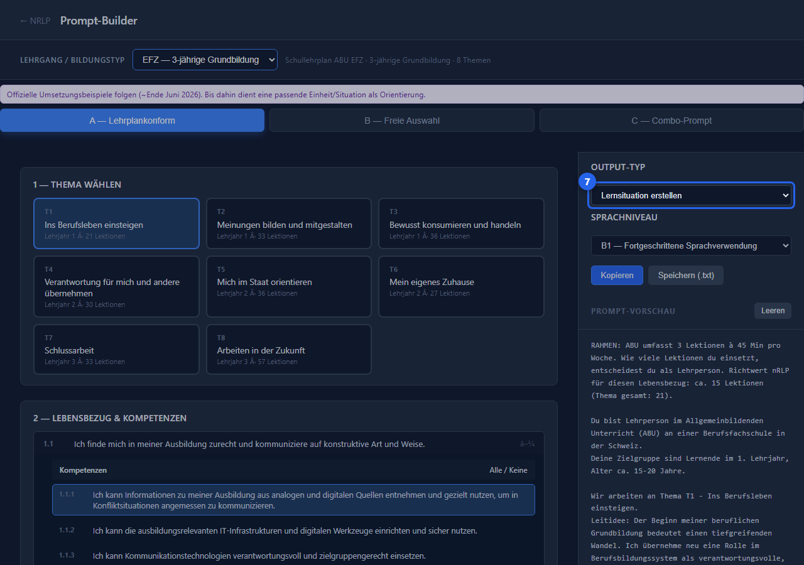

http://localhost:4321/nrlp/prompt-builder/index.html?role=lp

### 8. Der Prompt rechts passt sich dem gewählten Typ an — hier ein **Beurteilungsraster**. So erzeugst du aus derselben Auswahl ganz unterschiedliche Materialien.

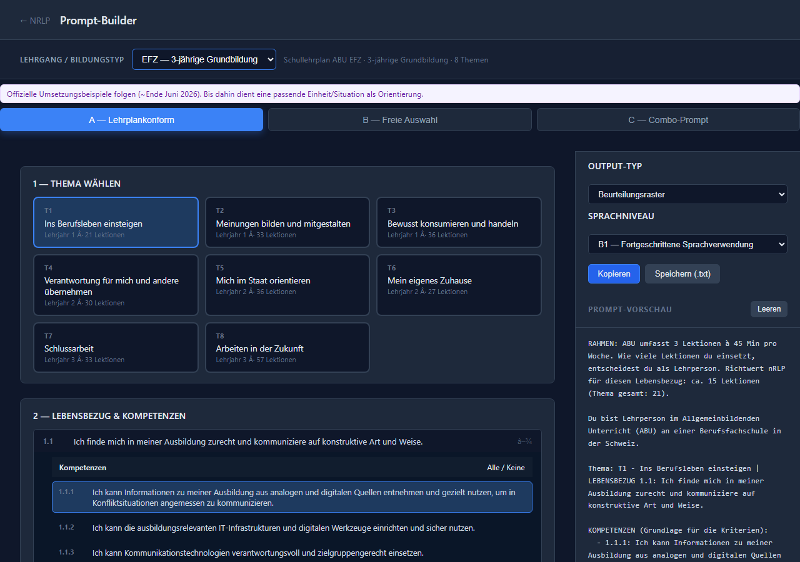

http://localhost:4321/nrlp/prompt-builder/index.html?role=lp

### 9. Mit **«Kopieren»** landet der fertige Prompt in der Zwischenablage; **«Speichern (.txt)»** legt ihn als Datei ab. Füge ihn anschliessend in dein Sprachmodell ein (z. B. Claude oder ChatGPT).

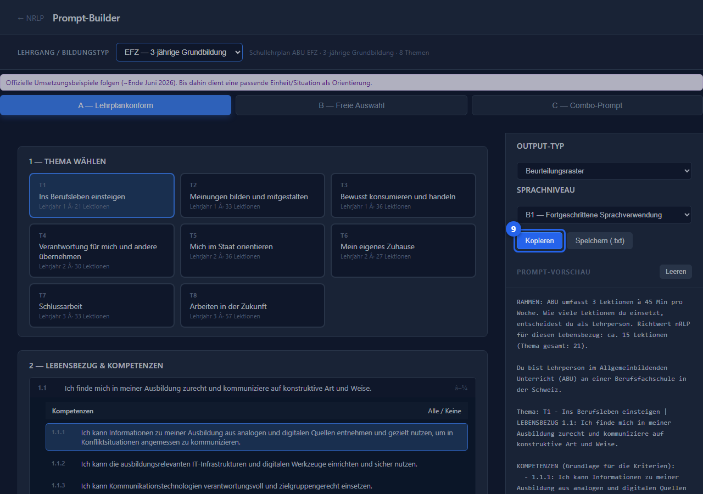

http://localhost:4321/nrlp/prompt-builder/index.html?role=lp

## Combo-Kette (Modus C)

### 10. Im Modus **«C — Combo-Prompt»** erzeugt der Builder eine zusammenhängende **6-Schritt-Kette**, die alle Output-Typen aufeinander aufbaut.

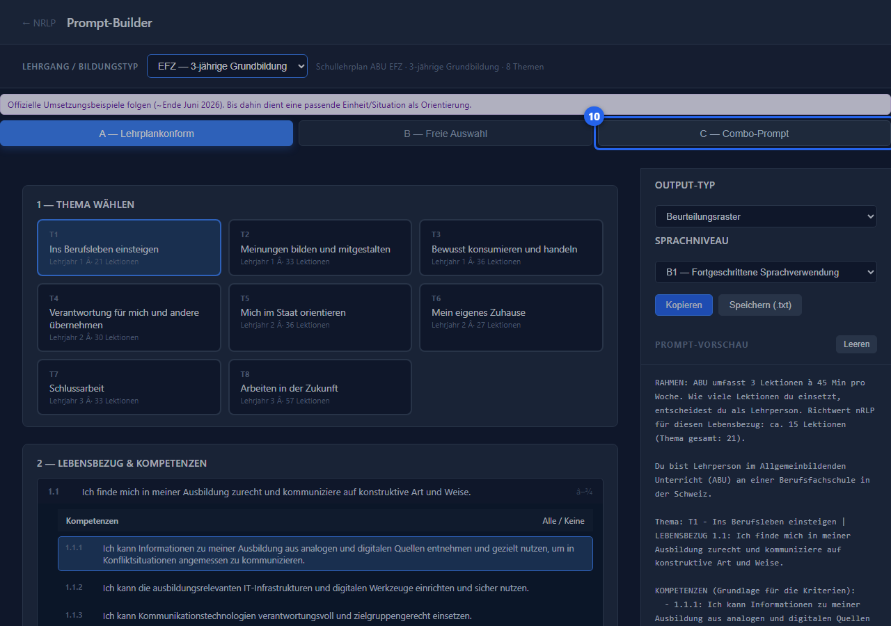

http://localhost:4321/nrlp/prompt-builder/index.html?role=lp

### 11. Wähle oben den **Selektions-Stil** (Strukturiert A / Flexibel B) und triff dann wie gewohnt deine Auswahl — beginne wieder mit dem **Thema**.

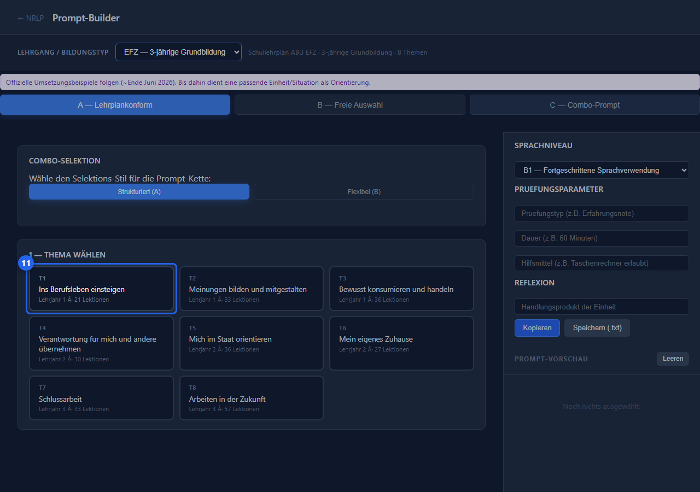

http://localhost:4321/nrlp/prompt-builder/index.html?role=lp

### 12. Die **Combo-Kette**: von der Lernsituation über Aufgabe, Raster, Prüfung und Arbeitsblatt bis zur Reflexion — als ein zusammenhängender Arbeitsauftrag für dein Sprachmodell.

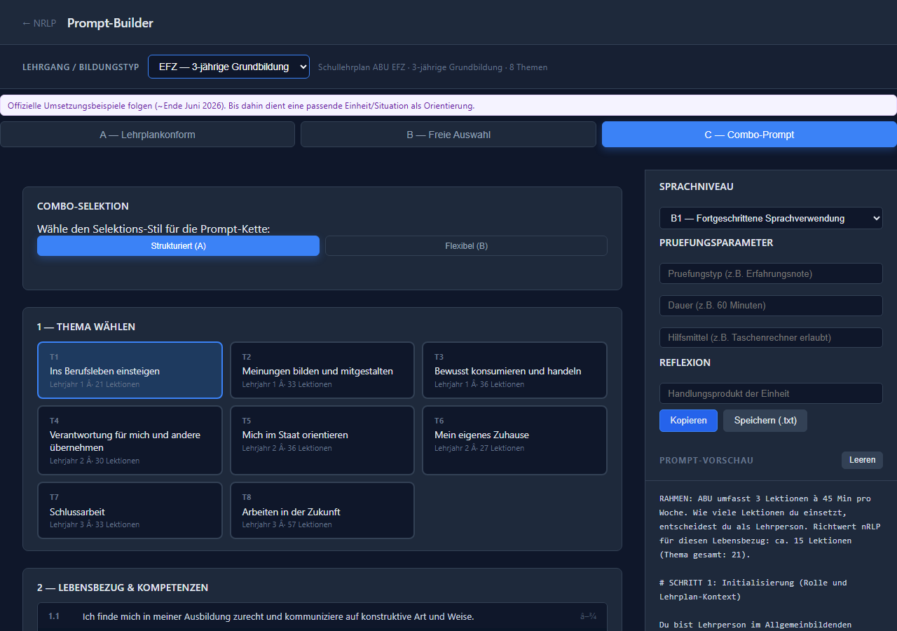

http://localhost:4321/nrlp/prompt-builder/index.html?role=lp
