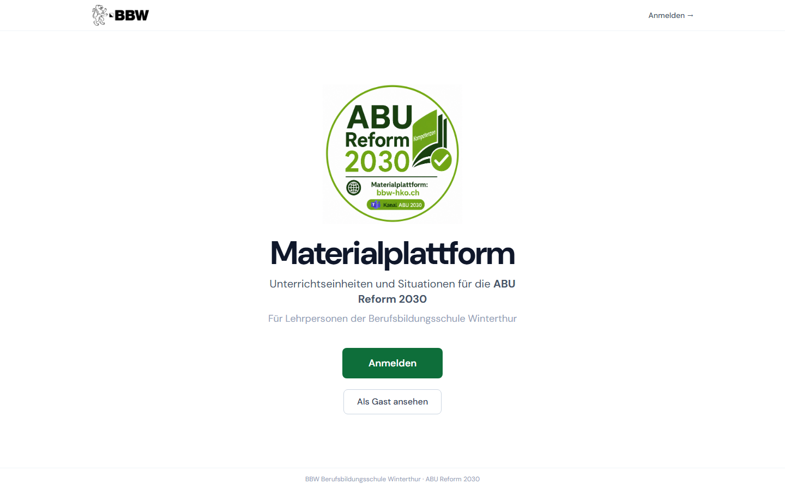
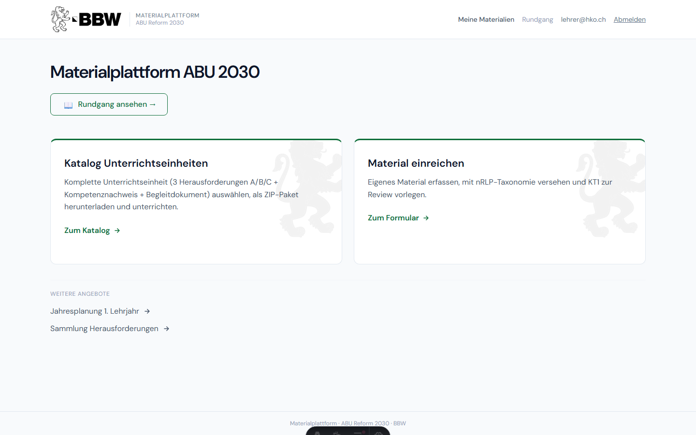
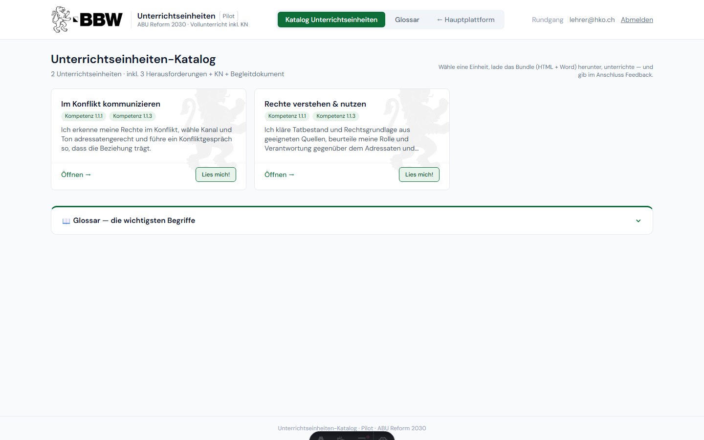
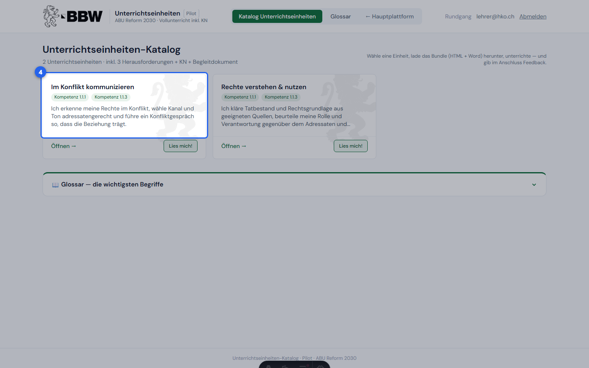
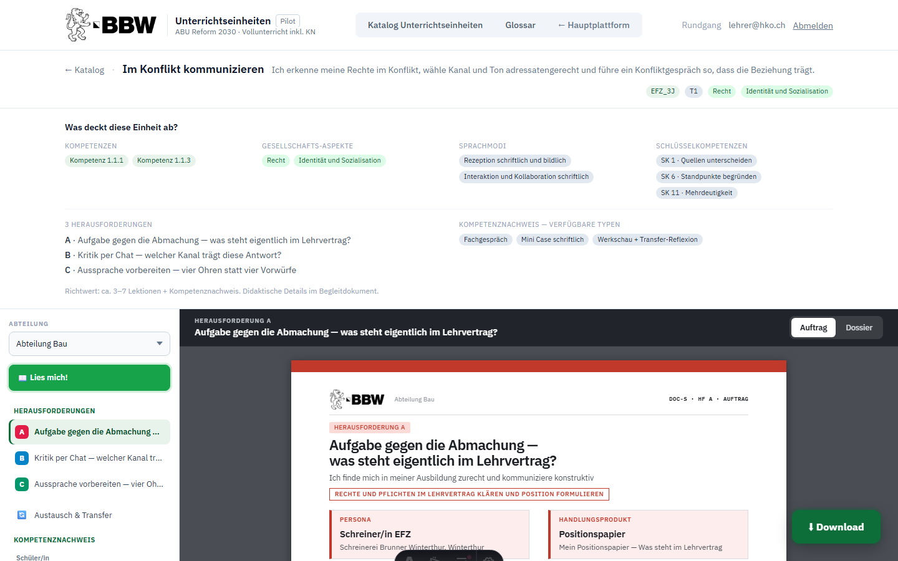
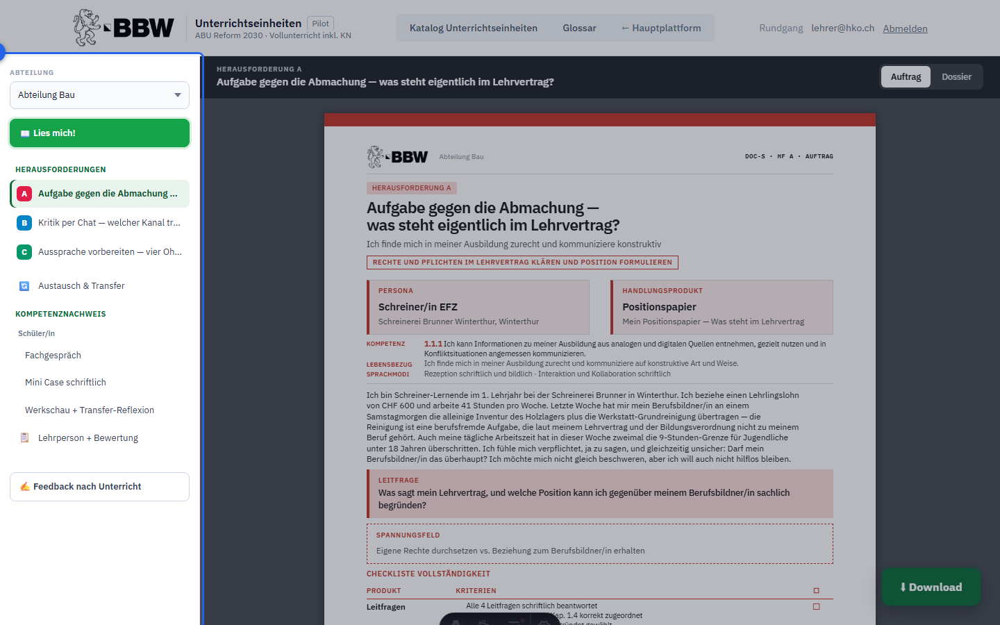
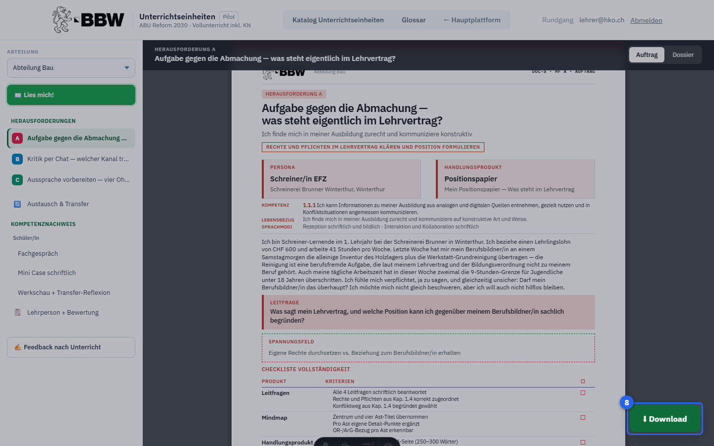
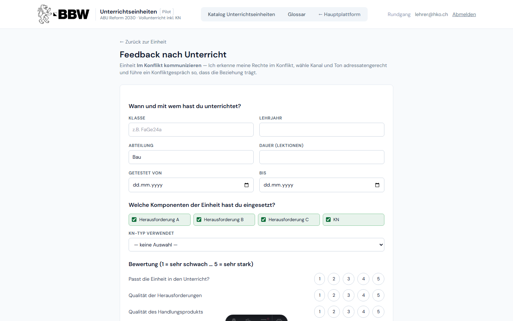

# ABU-Materialplattform — Einführung & Rundgang

Ein geführter Rundgang durch die Plattform — vom Einstieg über den Hub bis zur kompletten Unterrichtseinheit. Schritt für Schritt: wo ist was.

## Einstieg

### 1. Öffne die Plattform unter **bbw-hko.ch**. BBW-Lehrpersonen klicken auf **«Anmelden»** und melden sich mit ihrem BBW-Microsoft-Konto an — kein zusätzliches Passwort nötig. Wer nur schauen möchte, kann die Plattform auch als **Gast** besuchen.

https://bbw-hko.ch/welcome

## Hauptplattform

### 2. Nach der Anmeldung erscheint die **Hauptplattform**. Die zwei Hauptkacheln führen zu den zentralen Workflows: **Katalog Unterrichtseinheiten** (fertige Einheiten auswählen, Bundle herunterladen, unterrichten) und **Material einreichen** (eigenes HKO-Material teilen und von KT1 prüfen lassen). Unter **«Weitere Angebote»** findest du die Jahresplanung und die Sammlung der Herausforderungen.

http://localhost:4321/

## Einheiten-Katalog

### 3. Klicke auf **«Katalog Unterrichtseinheiten»**. Der Katalog zeigt alle fertigen Unterrichtseinheiten — jede enthält 3 Herausforderungen A/B/C, einen Kompetenznachweis und ein Begleitdokument für Lehrpersonen.

http://localhost:4321/einheiten

### 4. Jede **Einheiten-Karte** zeigt den Titel der Einheit und das Kompetenzversprechen. **«Öffnen →»** öffnet die Werkbank mit allen Dokumenten; **«Lies mich!»** öffnet direkt das Lehrpersonen-Begleitdokument.

http://localhost:4321/einheiten

## Werkbank

### 5. Klicke auf **«Öffnen →»**, um die **Werkbank** zu öffnen. Links die Navigationsleiste (Sidebar), rechts die grosse Dokumentvorschau.

http://localhost:4321/einheiten/1.1.1_konflikt_kommunizieren

### 6. Die **Sidebar** listet alle Dokumente der Einheit als Baum: Herausforderungen A · B · C, Austausch & Transfer, Kompetenznachweis (Schüler/in + Lehrperson) und den Feedback-Button. Ein Klick auf einen Eintrag zeigt das Dokument sofort rechts an.

http://localhost:4321/einheiten/1.1.1_konflikt_kommunizieren

### 7. Im **Vorschau-Bereich** siehst du live, wie das Dokument aussieht — druckfertig als A4-Seite. Oben im dunklen Dokumentkopf schaltest du beim Situationsheft zwischen **Auftrag** (leere Vorlage für Lernende) und **Dossier** (mit ausgearbeiteter Lösung) um.

http://localhost:4321/einheiten/1.1.1_konflikt_kommunizieren

### 8. Der grüne **Download-Button** unten rechts lädt die gesamte Einheit als ZIP-Paket herunter — alle Dokumente als HTML und Word, plus Begleiter und README. Eine Einheit umfasst typischerweise 22–33 Dateien.

http://localhost:4321/einheiten/1.1.1_konflikt_kommunizieren

## Nach dem Unterricht

### 9. Nach dem Unterricht: Klicke in der Werkbank auf **«Feedback nach Unterricht»**. Das Formular erfasst, wie die Einheit lief — welche Herausforderungen und KN-Typen eingesetzt wurden, was gut klappte und was verbessert werden sollte. Jedes Feedback fliesst direkt ins Review des Kernteams 1.

http://localhost:4321/einheiten/1.1.1_konflikt_kommunizieren/feedback
