# Material einreichen — Schritt für Schritt

Diese Kurzanleitung erklärt das Formular «Eigenes Material teilen» — von der Verortung im Lehrplan bis zum Einreichen. Pflichtfelder sind mit * markiert; alle anderen Blöcke sind optional, aber wertvoll.

## Überblick

### 1. Öffne **Material einreichen** über die Navigation. Das Formular ist in Blöcke A · B · H · K · Z · O gegliedert — jeder Block entspricht einem Schritt der Backward-Design-Kette: Kompetenzversprechen → Handlungssituation → Kompetenznachweis.

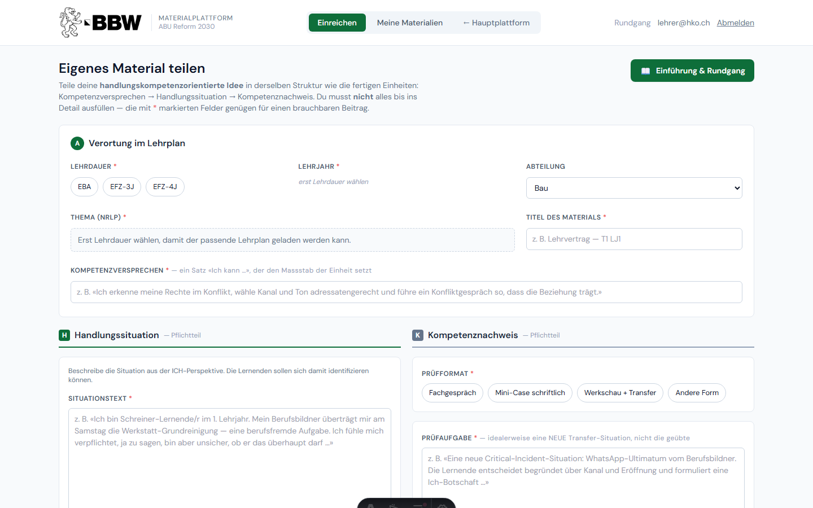

http://localhost:4321/einreichen

## Block A — Verortung

### 2. **Block A — Verortung:** Wähle zuerst **Lehrdauer** (EFZ-3J / EFZ-4J / EBA) und **Lehrjahr**. Der passende Lehrplan wird danach automatisch geladen.

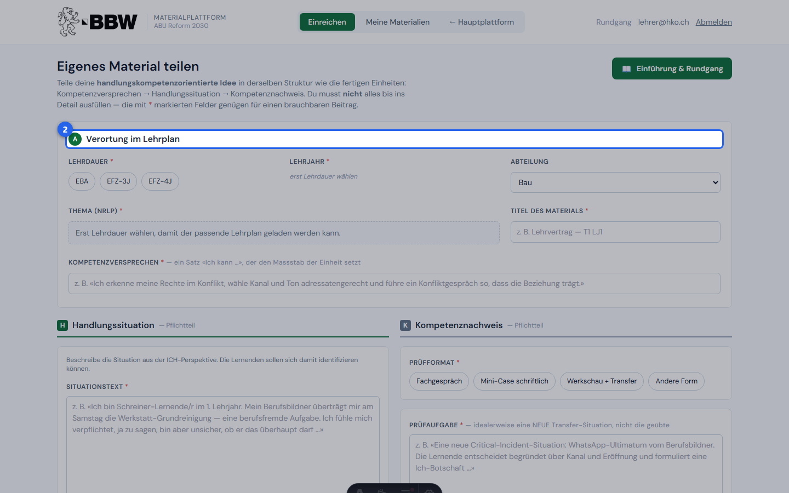

http://localhost:4321/einreichen

### 3. Sobald der Lehrplan geladen ist, wähle **Thema**, **Lebensbezug** und **Kompetenz** aus den Dropdowns. Für das **Kompetenzversprechen** («Ich kann …») schlägst du einen eigenen Satz vor — oder es wird aus der Lehrplan-Kompetenz vorausgefüllt.

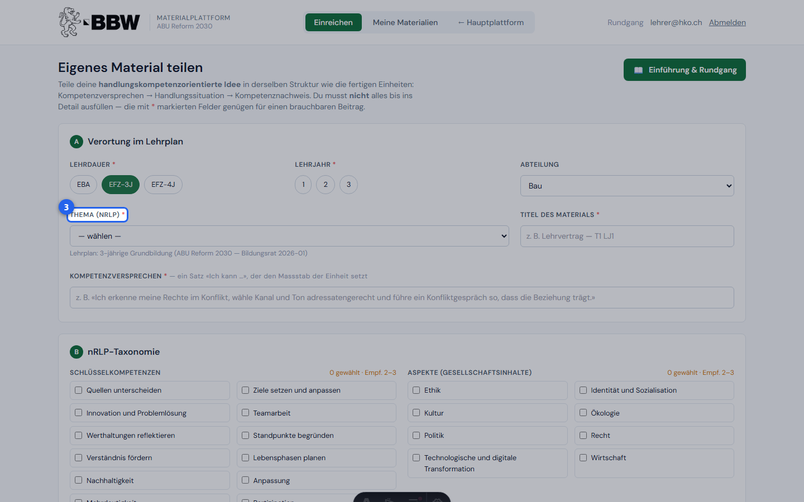

http://localhost:4321/einreichen

## Block B — Taxonomie

### 4. **Block B — nRLP-Taxonomie:** Hake die passenden **Schlüsselkompetenzen** (SK) und **Gesellschaftsinhalte** (Aspekte) an. Empfohlen sind je 2–3. Der grüne Button **«Empfohlene Taxonomie übernehmen»** setzt alle Häkchen automatisch auf die Lehrplan-Empfehlung.

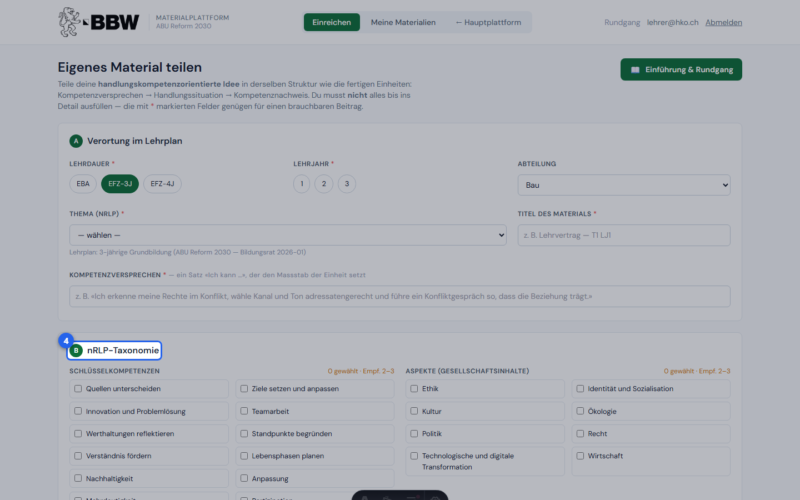

http://localhost:4321/einreichen

### 5. Wähle den **primären Sprachmodus** (z. B. «Argumentieren») aus dem Dropdown. Sekundäre Sprachmodi können zusätzlich angehakt werden.

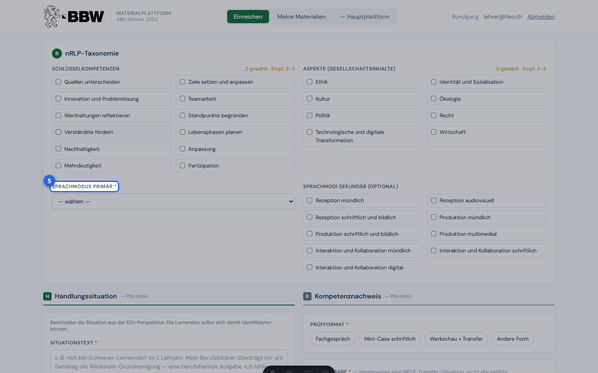

http://localhost:4321/einreichen

## Block H — Handlungssituation

### 6. **Block H — Handlungssituation** (linke Seite): Der **Situationstext** beschreibt die Ausgangslage aus ICH-Perspektive — die Lernenden sollen sich damit identifizieren und als Handelnde in der Situation erkennen können.

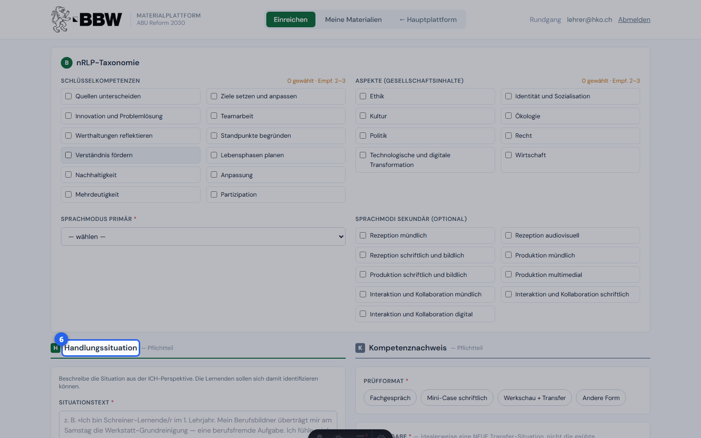

http://localhost:4321/einreichen

### 7. Das **Handlungsprodukt** beschreibt, was die Lernenden am Ende produzieren: Typ (Schriftlich / Mündlich / Multimedial / Mischform) und eine kurze Beschreibung. Darunter folgt eine optionale **Checkliste Handlungssituation**.

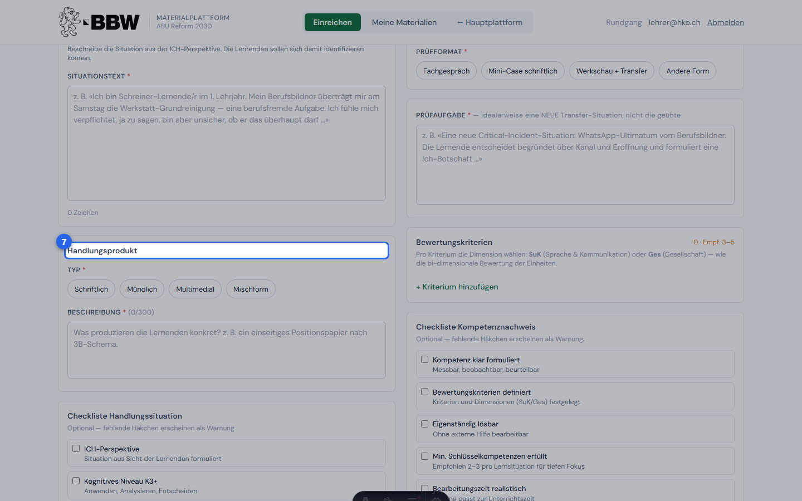

http://localhost:4321/einreichen

## Block K — Kompetenznachweis

### 8. **Block K — Kompetenznachweis** (rechte Seite): Wähle das **Prüfformat** (Fachgespräch / Mini-Case / Werkschau / Andere) und formuliere die **Prüfaufgabe** — idealerweise eine neue Transfer-Situation, nicht die geübte.

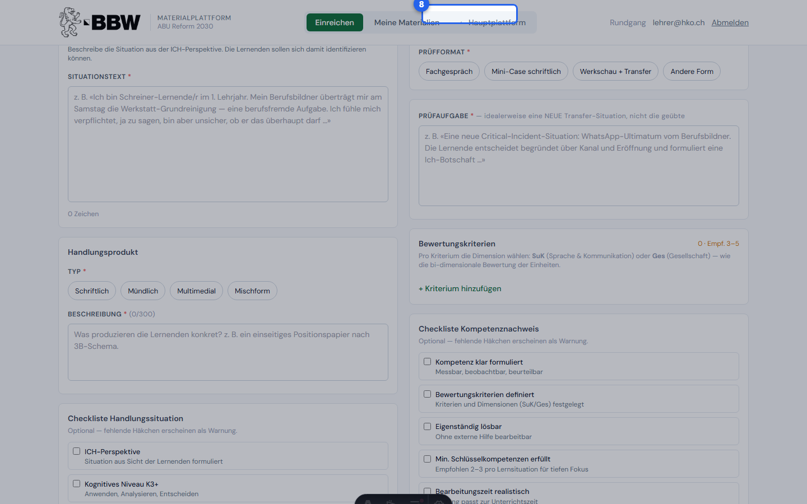

http://localhost:4321/einreichen

### 9. Unter **Bewertungskriterien** definierst du 3–5 Kriterien mit der Dimension **SuK** (Sprache & Kommunikation) oder **Ges** (Gesellschaft). Klicke auf «+ Kriterium hinzufügen», um neue Zeilen anzulegen.

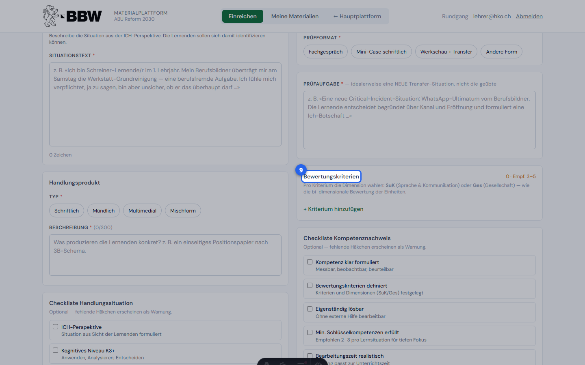

http://localhost:4321/einreichen

## Zusatzmaterialien & Anreicherung

### 10. **Block Z — Zusatzmaterialien:** Lade fertige Unterlagen hoch (Arbeitsblätter, Bewertungsraster, Präsentationen, Bilder). Max. 15 MB pro Datei. Die Dateien werden nur für dich und KT1 sichtbar gespeichert.

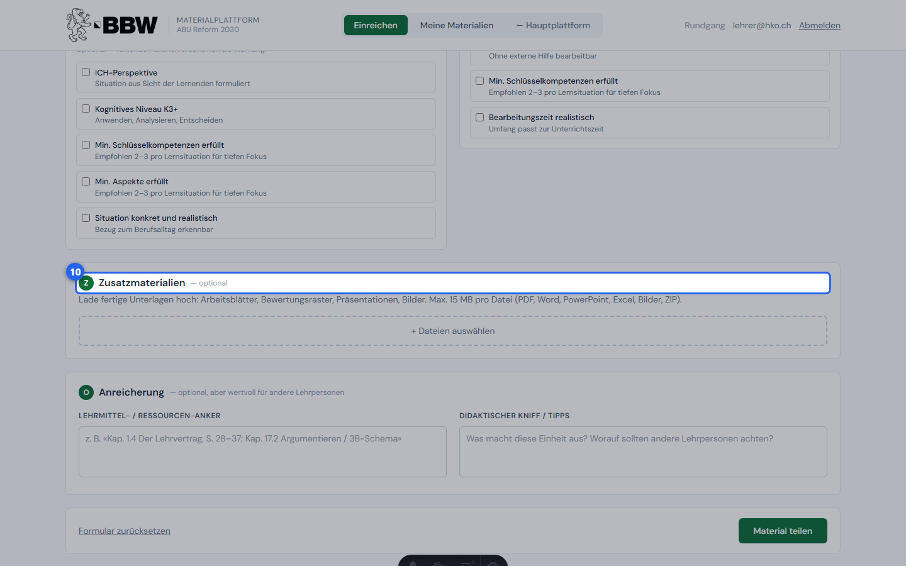

http://localhost:4321/einreichen

### 11. **Block O — Anreicherung (optional):** Füge einen **Lehrmittel-Anker** (Kapitelverweise) und einen **Didaktischen Kniff** hinzu — das hilft anderen Lehrpersonen, dein Material zu verstehen und einzusetzen.

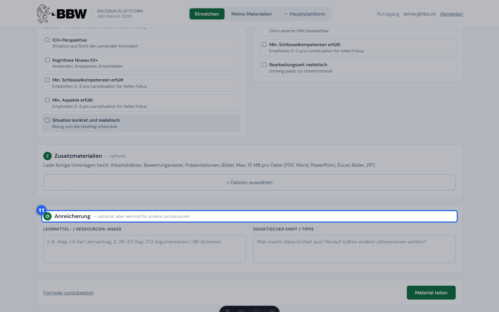

http://localhost:4321/einreichen

## Einreichen

### 12. Klicke auf **«Material teilen»**, um dein Material einzureichen. Es erscheint danach in «Meine Materialien» mit Status **eingereicht** und wird von KT1 geprüft. Du kannst es bis zur Freigabe jederzeit bearbeiten.

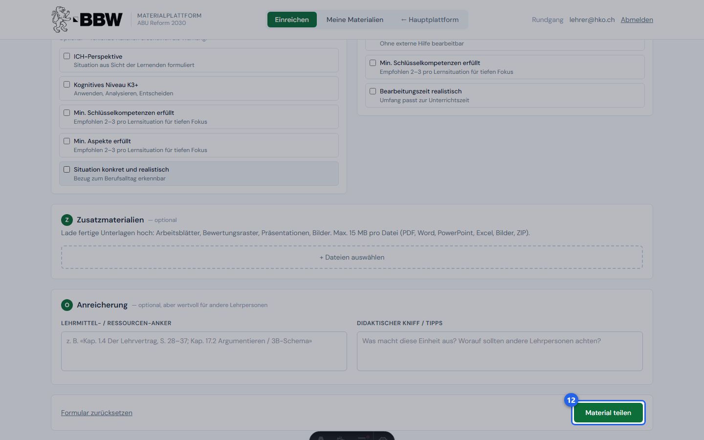

http://localhost:4321/einreichen
